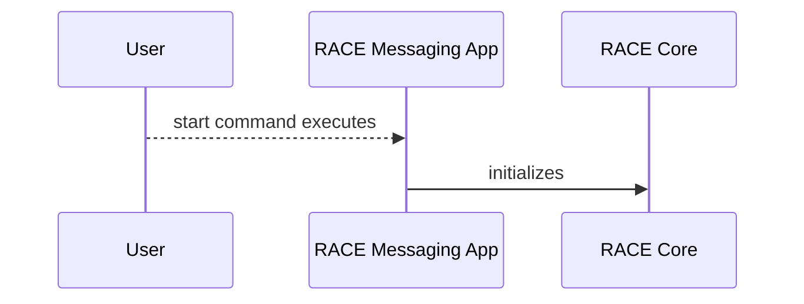

# **Resilient Anonymous Communication for Everyone (RACE) Butkus Encoding Guide**

## **Table of Contents**
TODO: generate once complete here http://ecotrust-canada.github.io/markdown-toc/

<br></br>

## **Introduction**
Butkus is an encoding component that encodes data into natural language English text. In addition, there is a RACE-independent commandline version runnable from the `butkus-cli` directory, see [the README](butkus-cli/README.md) for more information. Butkus currently has a high chance of failure trying to encode messages, so it should not be expected to work flawlessly in a RACE deployment.
</br>

### **Design Goals**
### **Security Considerations**

<br></br>

## **Scope**
This developer guide covers the *[Project Name]* development model, building artifacts, running, and troubleshooting.  It is structured this way to first provide context, associate attributes/features with source files, then guide a developer through the build process.  

*additional detail as appropriate*
</br>

### **Audience**
Technical/developer audience.

### **Environment**
Supports only linux x86_64 hosts. arm64-v8a hosts (e.g. apple-silicon macs) appear to suffer from sufficient performance problems as to make the encoding unusable.

Uses ~20GB of RAM per encoding instance (e.g. per-node for a local RACE deployment).

### **License**
See LICENSE file.

### **Additional Reading**
*Reference TBD User Guide, RACE dev guide, and appropriate TA dev guide*

*More specifically [Other File](relative/file/path.file)*
<br></br>

## **Implementation Overview**
*Top-level paragraph of what's in this project.  Additional detail on what this accomplishes (as appropriate)*

*Provide additional detail for terms defined in Terminology (as appropriate)*

*How is this expected to work in a RACE deployment?*

*Mermaid flow diagram(s) to illustrate internal state, and other interesting inter-workings*

There are several Mermaid diagrams in this document.  See https://docs.github.com/en/get-started/writing-on-github/working-with-advanced-formatting/creating-diagrams for more info about viewing Mermaid diagrams in github.  Mermaid diagrams can also be viewed in Visual Studio with Marketplace extensions: Markdown, and Markdown Preview Mermaid Support.  


<br></br>

## **Implementation Organization**
*description of each directory or file with detail sufficient to direct readers to specific attribute/functionality they may wish to inspect or change*

*map attributes to implementation in the following*
### **Feature/Attribute I**
  - *file/directory Q supports attribute I by ...*
  - *file/directory R supports attribute I by ...*
### **Feature/Attribute J**
  - *file/directory S supports attribute J by ...*
  - *file/directory T supports attribute J by ...*

<br></br>

## **How To Build**
*General build environment detail as appropriate (state what each artifact does, build considerations Linux vs Android)*

</br>

### **Artifact X**
*Artifact X is built in [insert build environment].  Artifact X is built with the following command(s)/script(s)*

*map artifact to deployed artifacts if this isn't a stand-alone deployable artifact*

*Info about build command(s)/script(s) (e.g. flags, context-sensitive env considerations)*

Command line example format (see markdown syntax https://www.markdownguide.org/cheat-sheet/):
```
cd <build_dir>
./do_stuff.py --flagX --flagY
cd <other_build_dir>
./do_other_stuff.sh --flagZ
```

#### **Parameters**
*build flags (what flags enable hardened deployment?  disable logging?)*

#### **Dependencies**
*state required packages, etc*

#### **Manifest**
*requirements - classify plugin for Core*

*channel properties - characterize operating profile (direct/indirect, loader/creator, expected latencies/bandwidth, roles, hints, etc)*

#### **Assumptions**
*as appropriate*

#### **Known Limitations**
*as appropriate*

#### **Tests**
*Brief: what requirements do test(s) cover*

*How to build and run tests*

</br>

### **Artifact Y**
*same as above*


<br></br>

## **How To Run**
### Standalone
See [butkus-cli](butkus-cli/README.md).

### Integrated with RACE
Include the butkusLocalRedis composition and both this kit and the plugin-comms-twosix-decomposed-cpp kit (to provide Transport and User Model components). Example commands:

```
rib deployment local create  --name=butkus \
    --linux-client-count=2 \
    --linux-server-count=2 \
    --race-node-arch=x86_64 \
    --comms-channel=butkusLocalRedis \
    --comms-channel=twoSixDirectCpp \
    --comms-kit=local=/code/race-butkus/kit \
    --comms-kit=core=plugin-comms-twosix-decomposed-cpp \
    --comms-kit=core=plugin-comms-twosix-cpp

rib-use local butkus
deployment config generate --network-manager-custom-args="--disableDynamicLinks" --force
```

___Note:___ the custom argument to disable dynamic links is to remove control traffic from the NetworkManager, because Butkus' failure rate means the deployment may stall before it is ready to send messages.

</br>

### **Artifact X**
#### **Parameters**
*run flags (required or optional, and what they do, how do they change if running small vs large deployment)*

### **Artifact Y**
#### **Parameters**
*run flags (required or optional, and what they do, how do they change if running small vs large deployment)*

<br></br>

## **Troubleshooting**
*State general troubleshooting philosophy*

*How to verify functionality is working and enabled*

### **Build Tips**
*List of tips as appropriate*

### **Common Issues**
*Anything to avoid in general (e.g. time-related issues: necessary delays)*

### **Debugging Tips**
*in addition to those stated in RACE dev guide*

<br></br>

## **How Do I?**
*How do I change attribute/capability A-Z (e.g. replace algorithm, change flag effect, etc.)*
